# Real-World Setup

We mount a [Jetson Orin AGX 64GB](https://www.nvidia.com/en-us/autonomous-machines/embedded-systems/jetson-orin/) on the [Unitree Go2](https://www.unitree.com/go2) robot.

## NVIDIA Jetson AGX Orin Setup

### Flash the System

Prepare the hardware following the [hardware setup guide](https://developer.nvidia.com/embedded/learn/jetson-agx-orin-devkit-user-guide/two_ways_to_set_up_software.html#hardware-setup).

First, complete the L4T BSP flashing process below.

#### SDK Manager Step 1: Select the Device and JetPack Version

Select **Jetson AGX Orin [64GB developer kit version]** and **JetPack 6.2.1**.

**Do NOT select Host Machine.**

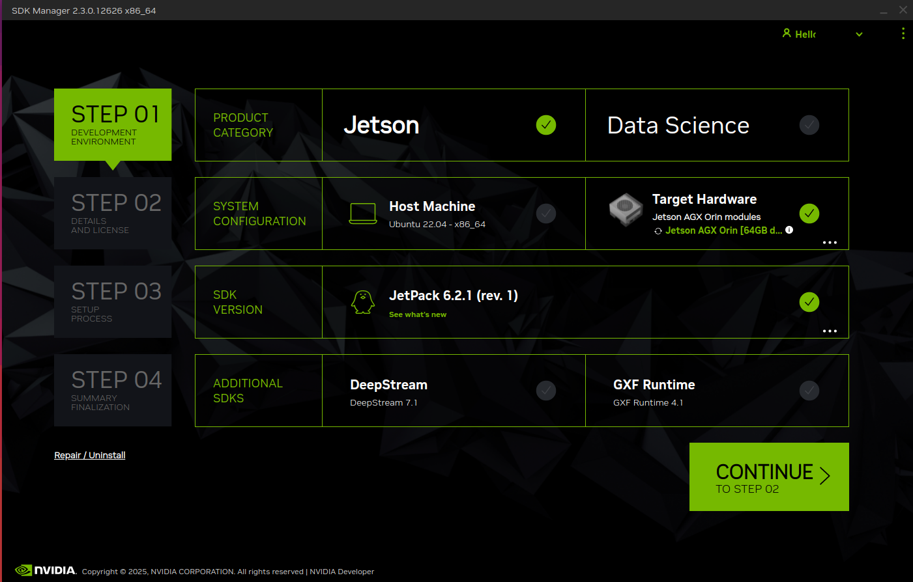

#### SDK Manager Step 2: Select Jetson Linux

Select **only the first entry, Jetson Linux**.

Do **NOT** select Jetson Runtime Components.

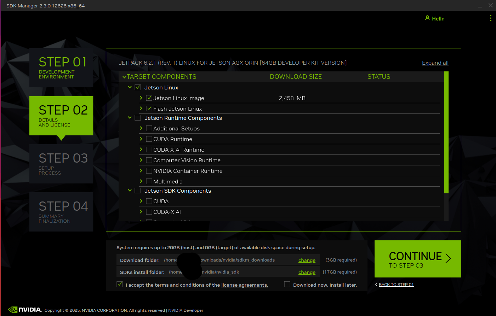

Click **Continue**.

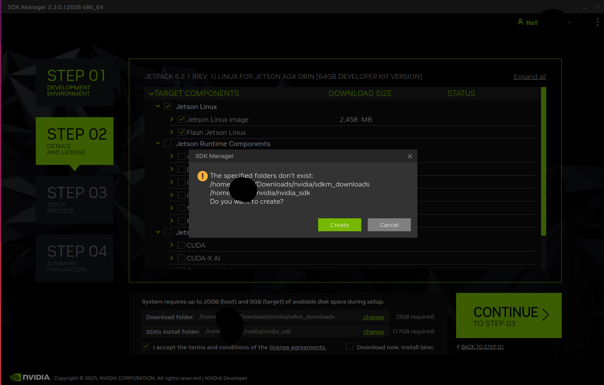

Click **Create**.

Then click **Continue** and enter your sudo password.

#### SDK Manager Step 3: Flash the Device

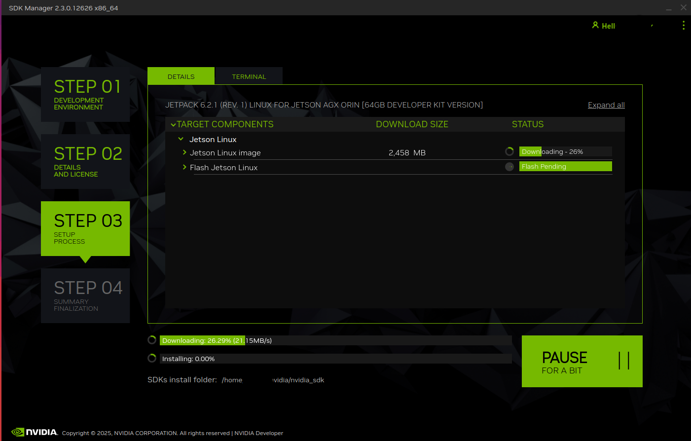

**Important: Choose RUNTIME and select NVME if an SSD is installed.**

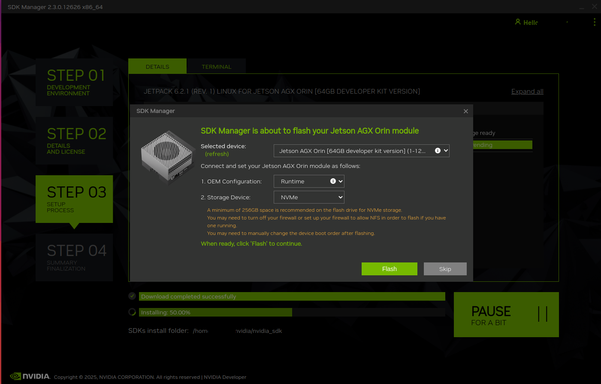

Click **Flash**.

After a while, SDK Manager returns to this page:

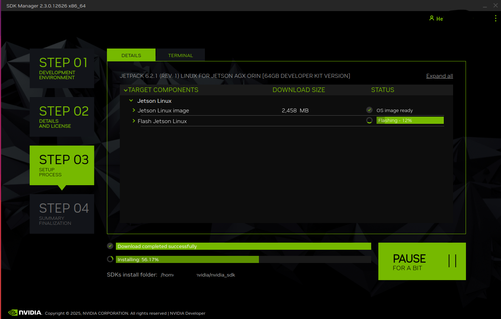

This step usually takes about 5–8 minutes.

#### SDK Manager Step 4: Finish Flashing

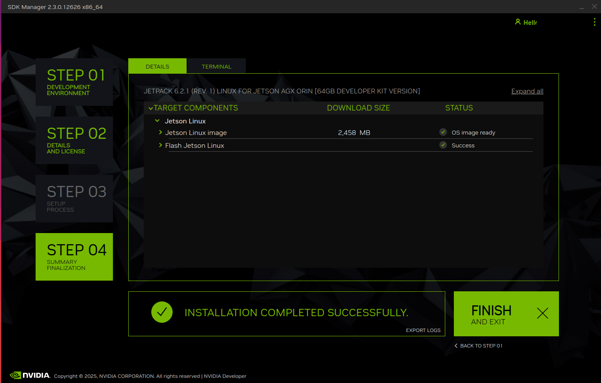

Flashing is complete.

### Install SDK Components

Before installing SDK components, complete the flashing process above and the initial Ubuntu setup.

Do **NOT** run `sudo apt update` or `upgrade` at this stage, as this may cause version mismatch errors later.

Follow the [SDK Manager guide](https://developer.nvidia.com/embedded/learn/jetson-agx-orin-devkit-user-guide/two_ways_to_set_up_software.html#1-how-to-use-sdk-manager-to-flash-l4t-bsp).

#### SDK Manager Step 1: Detect the Device

The AGX Orin does not need to be in Force Recovery Mode. Wait for SDK Manager to detect it.

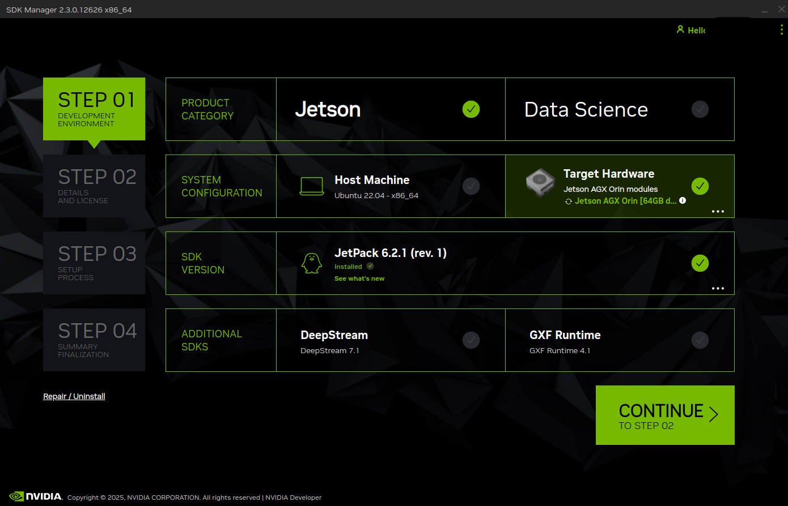

#### SDK Manager Step 2: Select SDK Components

Select the desired SDK components as shown below. SDK Manager automatically selects the Runtime components they require.

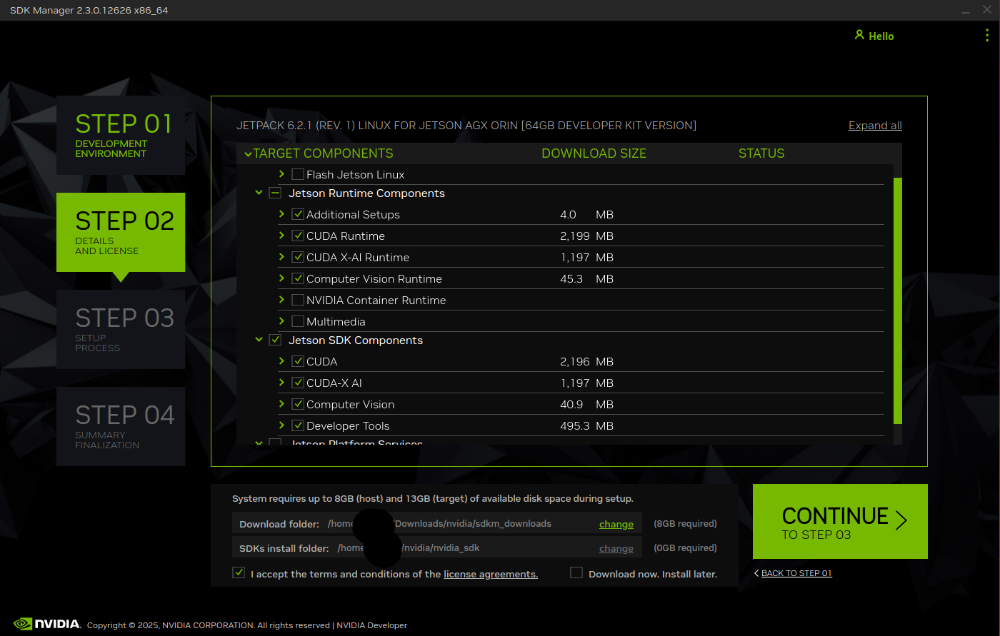

Click **Continue** and enter your sudo password.

#### SDK Manager Step 3: Install SDK Components

Configure the installation as shown below. Enter the Ubuntu username and password you set on the Jetson AGX Orin:

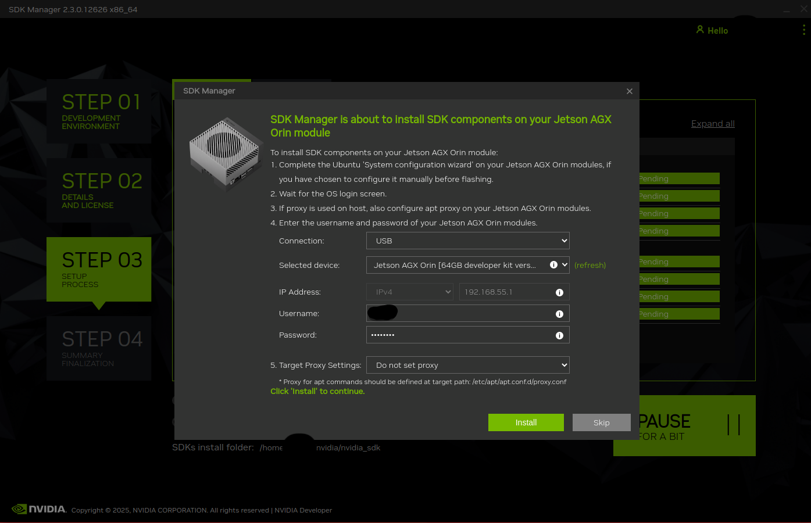

Click **Install**:

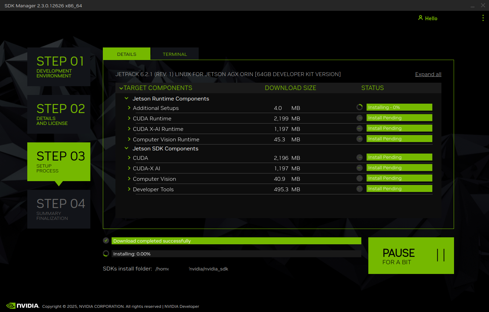

**Troubleshooting: Device image version mismatch**

If SDK Manager reports a device image version mismatch, follow [this guide](https://forums.developer.nvidia.com/t/error-installing-jetpack-6-2-1/337555/5).
This may be caused by running `sudo apt update` and `upgrade` during the initial Ubuntu setup. You can reflash the Jetson AGX Orin to resolve the mismatch.

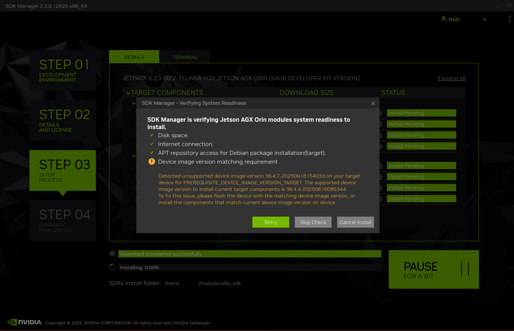

#### SDK Manager Step 4: Finish Installation

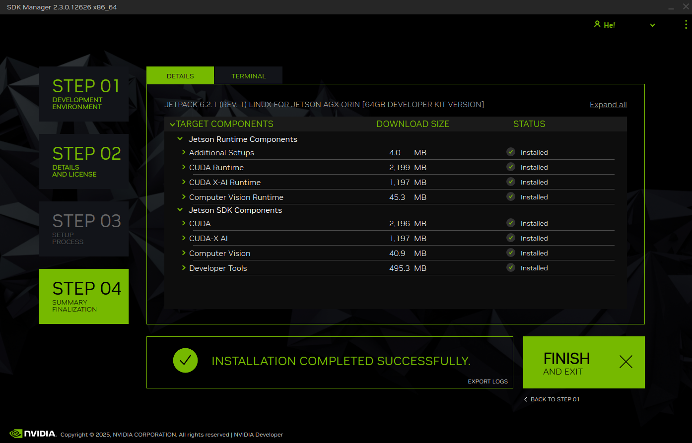