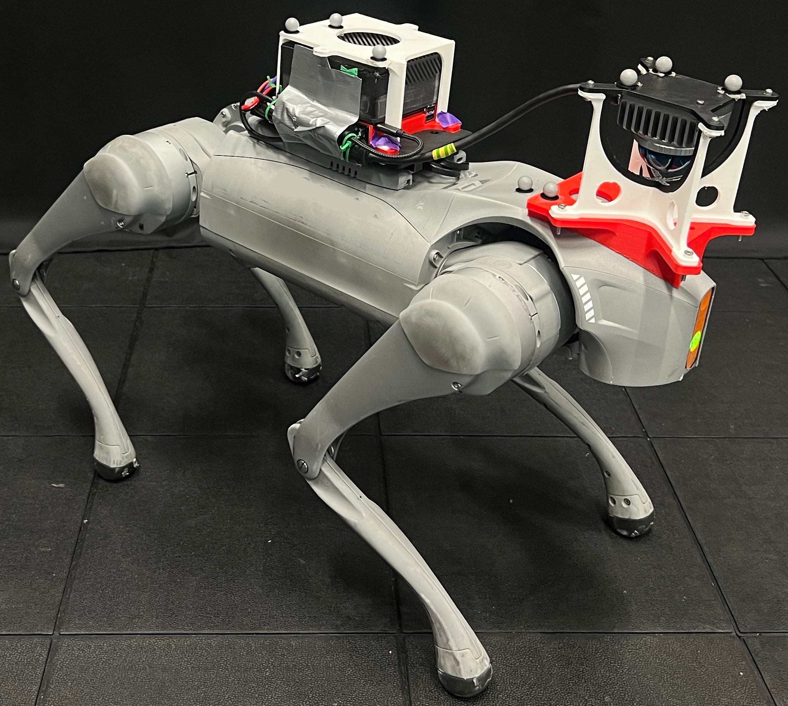

# JEPLO: Joint-Embedding Predictive Learning for LiDAR-Based Legged Locomotion

<!-- Replace the placeholder destinations with the website, arXiv, and dataset URLs. -->
\[**[Youtube](https://youtu.be/HekLtX37ijs?si=71ovMihlEU9Mnlk_)**\]
\[**[Website](https://img.shields.io/badge/Website-2563eb?style=flat-square)**\]
\[**[arXiv](https://img.shields.io/badge/arXiv-b31b1b?style=flat-square)**\]
\[**[Dataset](https://img.shields.io/badge/Dataset-16803c?style=flat-square)**\]

This is a JEPA-based mapless perceptive locomotion for quadrupedal robot (on Unitree Go2). It uses a single Mid-360 LiDAR for perception.



## Environment Setup

First create a conda envirnoment, install IsaacLab and IsaacSim:
```bash
conda create -n env_jeplo python=3.11 -y
conda activate env_jeplo
pip install --upgrade pip
pip install isaaclab[isaacsim,all]==2.3.2.post1 --extra-index-url https://pypi.nvidia.com
pip install -U torch==2.7.0 torchvision==0.22.0 --index-url https://download.pytorch.org/whl/cu128
```

Then install JEPLO:
```bash
# after cloning this repository and enter the cloned folder:
cd training
pip install -e go2_parkour
pip install -e lejepa
pip install -e rsl_rl
```

Install dependencies:
```bash
pip install wandb
```

## Training and Playing

To train a new policy:
```bash
# inside the training folder
python scripts/train.py --run_name my_policy --wandb_proj jeplo --num_envs 4096 --max_iterations 20000 --student_env_ratio 0.25 --warmup_iters 5000 10000
```
We strongly recommend using the MuJoCo validation tool to choose a good checkpoint. The training can be unstable sometimes and produce bad models (we usually test checkpoints after 15k iterations and find the one performing the best in MuJoCo).

To play a policy:
```bash
# inside the training folder
# play our pretrained policy
python scripts/play.py --load_run '^pretrained$' --num_envs 32
# add --student to play the student policy
# add --onnx_test_samples (requires --student) to export onnx model validation samples required by the deployment code
```

We found that TensorRT on Nvidia Jetson Orin sometimes produces trash models. Therefore a model should be validated by recorded input/output before controlling a real robot.

## Sim-to-Sim Validation in MuJoCo

With the exported onnx models and validation samples, we can test the policy in MuJoCo.

We have tested on Ubuntu 22.04. If you have other system, [distrobox](https://github.com/89luca89/distrobox) is recommended to setup an isolated environment.

Note that you will need a decent computer (with a Nvidia GPU to use TensorRT) to allow the simulation and control to run fast enough (we have tested it on a RTX 4090 laptop). Otherwise, the performance might degrade, since this is an asynchronous evaluation environment, mimicing the scenario on a real robot.

### Optional: Distrobox

If you are not on Ubuntu 22.04 and want use distrobox, you can create a container and exposing Nvidia GPU to it:
```bash
distrobox create -i ubuntu:22.04 --name ubuntu-22-04 --home /home/YOUR_USER_NAME/ubuntu_22_04 --hostname ubuntu2204 --nvidia
```
Then enter it with:
```bash
distrobox enter ubuntu-22-04
```

Check availability of GPU:
```bash
nvidia-smi
```

### Build Unitree Mujoco with LiDAR simulation

Whether within distrobox or on Ubuntu 22.04 (it might also work on Ubuntu 24.04 or 26.04, but we haven't tested), now we install unitree_mujoco first.

```bash
sudo apt update 
sudo apt install -y build-essential cmake git libyaml-cpp-dev libspdlog-dev libboost-all-dev libglfw3-dev libfmt-dev libzmq3-dev libeigen3-dev
```

Install untiree_sdk2 (last tested on 13th Sep. 2026):
```bash
cd
git clone https://github.com/unitreerobotics/unitree_sdk2.git ~/unitree_sdk2
cmake -S ~/unitree_sdk2 -B ~/unitree_sdk2/build \
-DCMAKE_INSTALL_PREFIX=/usr/local
cmake --build ~/unitree_sdk2/build --parallel
sudo cmake --install ~/unitree_sdk2/build
sudo ldconfig
```

Build unitree_mujoco (our customized version):
```bash
# first, go to jeplo folder (inside distrobox if you use it)
cd deployment/unitree_mujoco
rm -rf simulate/build
cmake -S simulate -B simulate/build -DCMAKE_BUILD_TYPE=Release
cmake --build simulate/build --parallel
```

Run unitree_mujoco:
```bash
cd simulate/build
./unitree_mujoco --lidar # no need for specifying other flags
```
This should pop up a MuJoCo window with a Untiree Go2 robot.

### Build Depth Image Generator

We use a separate depth generator (from LiDAR point clouds) to ensure the same deployment interface for sim-to-sim and sim-to-real.

First install [ROS2 Humble](https://docs.ros.org/en/humble/Installation/Ubuntu-Install-Debs.html).

Then install Livox ROS2 driver and Livox SDK2 following [this](https://github.com/livox-SDK/livox_ros_driver2). Last tested on 14th Sep. 2026. (If you encounter "colcon not found" error, install it first: `sudo apt update && sudo apt install python3-colcon-common-extensions`)

Source ROS2 and the Livox driver workspace before going on.

```bash
# install dependencies
sudo apt update
sudo apt install -y build-essential cmake pkg-config libzmq3-dev

# source ros2 and livox driver (if you haven't done so)
source /opt/ros/humble/setup.bash
source ~/ws_livox/install/setup.bash

# before this, go to jeplo folder (inside distrobox if you use it)
cd deployment/lidar_depth_pub

# build depth generator
rm -rf build
cmake -S . -B build -DCMAKE_BUILD_TYPE=Release
cmake --build build --target lidar_depth_pub --parallel
```

Now we can run the depth generator with:
```bash
./build/lidar_depth_pub --sim --downsample-rate 4 --fov 25x60
```
This won't open any window, but if you have launched unitree_mujoco with `--lidar`, it will print received and published messages.

### Build Deployment Code

Now we can build the deployment code. First install dependencies:
```bash
sudo apt update
sudo apt install -y build-essential cmake pkg-config libeigen3-dev libfmt-dev libzmq3-dev zlib1g-dev python3-pip
pip install pygame numpy pyzmq
```

Next install ONNX Runtime with TensorRT support. Go to the [release page](https://github.com/microsoft/onnxruntime/releases) and download prebuilt binaries. We have tested with this file: `onnxruntime-linux-x64-gpu-1.22.0.tgz`. Then follow these steps:
- Extract the folder and copy the “include” folder to “/usr/local”.
- Copy the “lib” folder as “/usr/local/lib64”.
- Copy the “lib/cmake” folder to “/usr/local/lib”.
- Add “/usr/local/lib64” to your “LD_LIBRARY_PATH”:
```bash
export LD_LIBRARY_PATH=/usr/local/lib64:$LD_LIBRARY_PATH
```

Now download TensorRT 10.9 GA from [here](https://developer.nvidia.com/tensorrt) and extract to a separate folder.  We have tested with this version:
**TensorRT 10.9 GA for Linux x86_64 and CUDA 12.0 to 12.8 TAR Package**. After downloading and extracting, add `lib` folder of extracted TensorRT to your `LD_LIBRARY_PATH`:
```bash
export LD_LIBRARY_PATH=/absolute/path/to/tensorrt/lib:$LD_LIBRARY_PATH
```

Now we install CUDA and cuDNN. First, install cuda-12.8 and cudnn-9 and add to LD_LIBRARY_PATH  
Install cuda-12.8 follow [this](https://developer.nvidia.com/cuda-12-8-0-download-archive?target_os=Linux&target_arch=x86_64&Distribution=Ubuntu&target_version=22.04&target_type=deb_local). Then install cudnn-9 follow [this](https://developer.nvidia.com/cudnn-downloads?target_os=Linux&target_arch=x86_64&Distribution=Ubuntu&target_version=22.04&target_type=deb_local).  
Finally add to `LD_LIBRARY_PATH`:
```bash
export PATH=/usr/local/cuda-12.8/bin${PATH:+:${PATH}}
export LD_LIBRARY_PATH=/usr/local/cuda-12.8/lib64${LD_LIBRARY_PATH:+:${LD_LIBRARY_PATH}}
```

Now build the deployment code:
```bash
# first to go jeplo folder
cd deployment/go2_deploy
./run_build.sh
```
This creates an output folder, including the built deployment program and copied configration files. If you want to change Kp/Kd, change it there. Other options do not need any change.

About `LD_LIBRARY_PATH`, we recommend adding those lines to `.bashrc` so that you don't have to export the variables in each new terminal.

### Sim-to-Sim Deployment

Now we can validate policies in the MuJoCo environment. 5 terminals are needed, assuming current working directory is the cloned jeplo folder.

Terminal 1 for unitree_mujoco:
```bash
cd deployment/unitree_mujoco/simulate/build
./unitree_mujoco --lidar
```
Here you can use `Backspace` to reset the scene, press `Ctrl+B` in the intial stairs scene to toggle the high box. Press `Ctrl+1`, `Ctrl+2`, `Ctrl+3`, and so on to switch different predefined scenes.

Terminal 2 for depth generator:
```bash
cd deployment/lidar_depth_pub
./build/lidar_depth_pub --sim --downsample-rate 4 --fov 25x60
```
This will generate a random mask to mimic the 3D-printed cage on the real robot. Use `--no-cage-mask` to disable it.

Terminal 3 for monitoring the generated depth images:
```bash
cd deployment/go2_deploy
python3 scripts/view_lidar_depth.py
```

Terminal 4 for running deployment code:
```bash
cd deployment/go2_deploy/output
./deploy --net lo --model-dir pretrained --ood-count-threshold 15 --raw-actions
```

Terminal 5 for keyboard control:
```bash
cd deployment/go2_deploy
python3 scripts/pygame_wm_control.py
```
With this, you can control the robot moving in MuJoCo.

## Deployment on Real Robot: Unitree Go2

For deployment on real robot, we basically reproduce the same environment on Jetson Orin AGX. The only difference is that when flashing with the SDK Manager, CUDA, cuDNN and TensorRT needs to be enabled so that we have those on-board.

On Jetson, first build the depth generator following the [previous instructions for sim-to-sim](#build-depth-image-generator).

To build the deployment code on Jetson, we need to flash Jetson Orin AGX and install SDK packages like CUDA, cuDNN, TensorRT and so on. Check [this](Flashing-Jetson.md) for details on flashing the system and installing components.

### Install Dependencies

Log into Jetson AGX Orin and check whether the required packages are installed correctly:
```bash
nvcc --version
ls -l /usr/local/cuda
ls /usr/lib/aarch64-linux-gnu/libcudnn*
ls /usr/lib/aarch64-linux-gnu/libnvinfer*
```

First, install packages:
```bash
sudo apt update
sudo apt install -y build-essential cmake pkg-config libeigen3-dev libfmt-dev libzmq3-dev zlib1g-dev
```

Next, install ROS2 Humble, Unitree SDK, and Livox driver following the previous sections ([this](#build-unitree-mujoco-with-lidar-simulation) and [this](#build-depth-image-generator)).

We need to build onnxruntime from source on Jetson, since the prebuilt binaries for `aarch64` do not support GPU backends. The procedure is based on [official manuscript](https://onnxruntime.ai/docs/build/eps.html#nvidia-jetson-tx1tx2nanoxavierorin).

We will install onnxruntime v1.23.2 from source code:
```bash
# does not matter in which folder
git clone --recursive --branch v1.23.2 https://github.com/microsoft/onnxruntime
sudo apt install -y --no-install-recommends build-essential software-properties-common libopenblas-dev libpython3.10-dev python3-pip python3-dev python3-setuptools python3-wheel
```

Install cmake 3.28.5 from [here](https://cmake.org/files/v3.28/).
Choose [`cmake-3.28.5-linux-aarch64.sh`](https://cmake.org/files/v3.28/cmake-3.28.5-linux-aarch64.sh).

```bash
chmod +x ./cmake-3.28.5-linux-aarch64.sh
sudo ./cmake-3.28.5-linux-aarch64.sh --prefix=/usr/local
# check cmake version; should be 3.28 now
cmake --version
# if you encounter errors or version not update, try rebooting.
```

Go to cloned [`onnxruntime`](https://github.com/microsoft/onnxruntime) project.
Make sure you set `onnxruntime\_BUILD\_UNIT\_TESTS=OFF` , more details in [github](https://github.com/microsoft/onnxruntime/issues/26425).
```bash
./build.sh --config Release --update --build --parallel --use_tensorrt --cuda_home /usr/local/cuda --cudnn_home /usr/lib/aarch64-linux-gnu --tensorrt_home /usr/lib/aarch64-linux-gnu --skip_tests --cmake_extra_defines 'CMAKE_CUDA_ARCHITECTURES=native' 'onnxruntime_BUILD_UNIT_TESTS=OFF' --build_shared_lib

cd build/Linux/Release
sudo make install

cd /usr/local/lib/cmake/onnxruntime
```

Open the cmake file and make some changes:
```bash
sudo vim ./onnxruntimeTargets-release.cmake
# change all "lib64" to "lib" and save
```

Now copy the `go2_deploy` and `lidar_depth_pub` folder to Jetson and build. They should work now. For `--net` argument of `deploy`, use the network interface name connecting Jetson to the robot. You can check with `ifconfig`, `ip addr` or `nmcli connection show`.

For `lidar_depth_pub`, run this on Jetson:
```bash
./build/lidar_depth_pub --fov 25x60 --no-cage-mask
```

For `go2_deploy`, run this on Jetson:
```bash
cd go2_deploy
./run_build.sh
cd output
./deploy --net <network, e.g., eno1> --model-dir pretrained --ood-count-threshold 15 --raw-actions --gamepad-mode joystick
```

After launching the deployment code, press `R1` (once) to switch to the wireless controller. We support joystick mode (`--gamepad-mode joystick`, default): left stick for movement and right stick for turning; and gamepad button mode (`--gamepad-mode buttons`) for one-handed control: `X` to move forward, `Y` to turn left, and `A` to turn right.

Press `B` for an emergency stop (zero velocity commands); press it again to stop the controller. The OOD (out-of-distribution) safety check flags excessive estimated joint torque or joint velocity. After `--ood-count-threshold` consecutive violations, deployment switches to damping mode.

For monitoring the depth images in real-time, run this on a PC in the same subnet:
```bash
python scripts/view_lidar_depth.py --host <IP.OF.THE.JETSON>
```

## Contributors

Qihao Yuan (Email: qihao.yuan@rug.nl)

Yixuan Qiu (Email: yixuan.qiu@rug.nl)

Ziyu Cao (Email: ziyu.cao@liu.se)

Kailai Li (Email: kailai.li@liu.se)

## Credits

We would like to thank [go2_rl_robotlab](https://github.com/wertyuilife2/go2_rl_robotlab) for their excellent open-source code!

## License

The source code is released under [GPLv3](https://www.gnu.org/licenses/) license. For commercial use, please contact Qihao Yuan at <qihao.yuan@rug.nl> or Kailai Li at <kailai.li@liu.se> to discuss an alternative license.